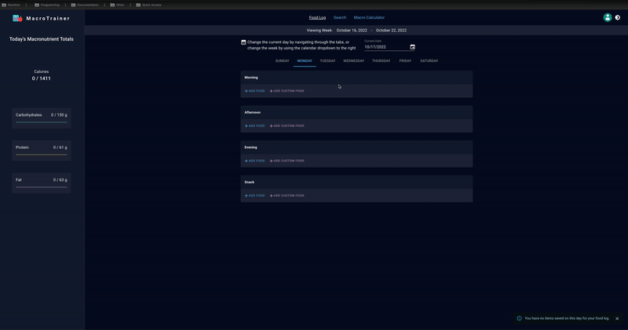

# The MacroTrainer

A full-stack food logging application that allows users to calculate their recommended calories and macronutrient needs based on their metrics. They can then search from a list of over 350,000 foods to find any that match their desired macronutrient ranges.

## Live Link

View live deployment [here](https://themacrotrainer.com) or see the demo below.

## Features & Usage

-  create account with username, email, password or sign in using Google
-  Enter height, weight, age, gender, fitness goals and activity level to calculate your total daily recommended calories, carbohydrates, protein, and fat
-  Save your favorite food items to your own personal food log
-  Search for food items with any custom nutrient ranges
-  Edit your recommended nutrient ranges by using the Macronutrient Calculator again or simply entering your preferred nutrient ranges
-  Dark and light modes are available for preferred viewing option. User's preferred viewing option is then saved to local storage for their next visit.

## Demo





## Tech Stack

This project was built with the following technologies:


## Setup/ Installation

-  Clone this repository and navigate to project directory in the terminal
-  Install necessary dependencies:

```bash
npm install
```

-  Create a client/dist directory and a index.html file for webpack to output content to.

-  Then, if environment is set for development, run the application like so:

```bash
npm run dev
```

This opens a development server in your local browser at port 3000.

-  To allow code-splitting to work when building files, must first change tsconfig.json 'module' variable to 'esnext'. Feel free to change back to 'commonjs' after building files to avoid errors with using import statements instead of require statements for modules.

-  When application is ready for production, have webpack build your bundle and minimize your files and then start the Express server:

```bash
npm run build
npm start
```

-  If application is hosted on an AWS EC2 instance, push changes to build to Github, connect to instance, then pull the updated changes (note free tier EC2 instance has issues with lower CPU power and cannot handle building full TypeScript project locally)

```bash
git push origin main
bash ec2-login.sh
git pull
```

-  Then restart PM2 process

```bash
sudo pm2 restart themacrotrainer
```

Then navigate to port 8080 in your browser to view your application.

## Testing

-  Run unit tests with Jest/React Testing Library:

```bash
npm run jest
```

-Then run end to end tests with Cypress:

```bash
npm run cypress
```

-Or run both tests concurrently:

```bash
npm run test
```

## Database

-To connect to RDS instance hosting postgresql database:

```bash
bash rds-login.sh
```

-If having issues connecting to RDS from EC2 instance, make sure correct permissions are being sent, as the name of the user sending requests from the EC2 instance is called 'root'. Therefore give permissions to this user:

```bash
GRANT rds_superuser TO root;
```

-All data was retrieved from CSV files provided by USDA and imported into RDS PostgreSQL database.

-  Note that branded foods use the nutrient_nbr field in the nutrient table as a foreign key for nutrition, while other data types use the nutrient id

## Resources

-  [React code-splitting](https://reactjs.org/docs/code-splitting.html)
-  [Intersection Observer API](https://developer.mozilla.org/en-US/docs/Web/API/Intersection_Observer_API)
-  [Spoonacular API](https://spoonacular.com/food-api/docs)
-  [Set up tests with Jest and Supertest](https://www.rithmschool.com/courses/intermediate-node-express/api-tests-with-jest)
-  [Set up users for PostgreSQL](https://stackoverflow.com/questions/42749033/fatal-password-authentication-failed-for-user-root-postgresql)
-  [Fixing issues with setting up PostgreSQL on RDS](https://stackoverflow.com/questions/65877048/pgadmin-on-ubuntu-20-04-fatal-password-authentication-failed-for-user)
-  [Getting correct permissions to tables for requests sent from EC2 instance](https://stackoverflow.com/questions/55080121/amazon-rds-postgresql-role-cannot-access-tables)
-  [Setting up custom domain when using Nginx](https://stackoverflow.com/questions/32467541/link-a-google-domain-to-amazon-ec2-server#:~:text=In%20your%20google%20domain%20admin,from%20the%20amazon%20EC2%20instance.)
